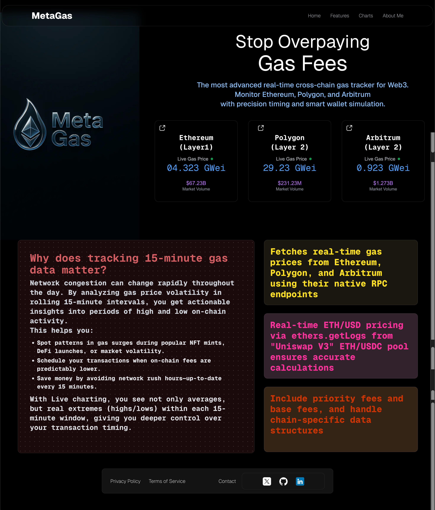
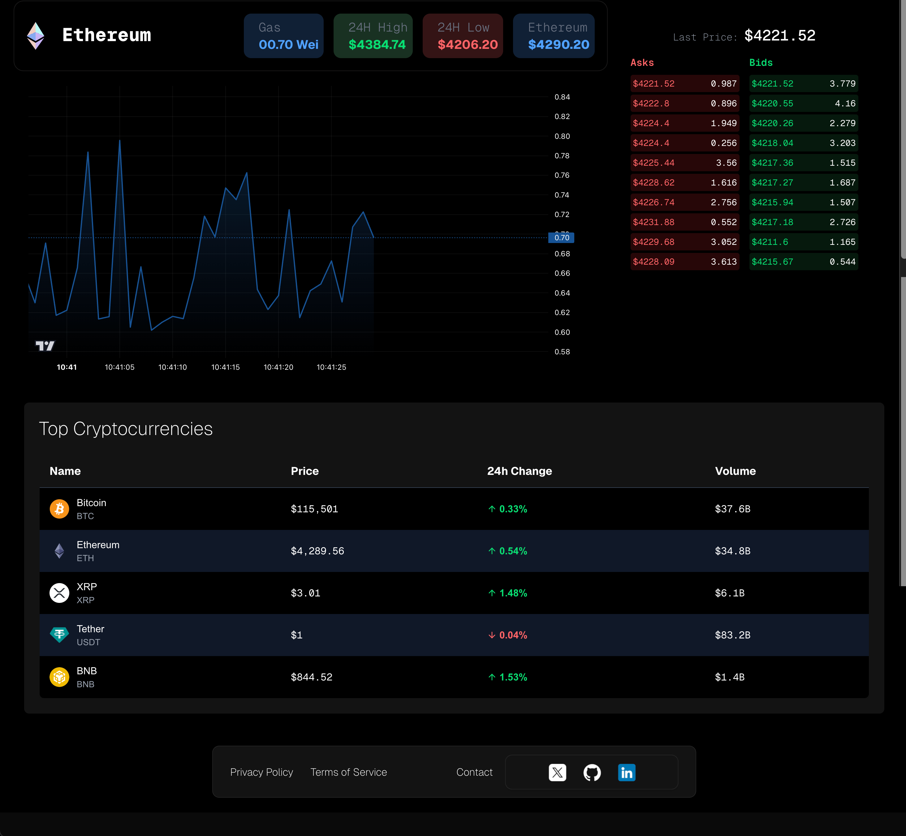

# MetaGas
Real-time cross-chain gas tracker for Web3. Monitor ```Ethereum```, ```Polygon```, and ```Arbitrum``` with configured ```redis``` cache, with precision timing using ```websockets```.
## Features
- Real-time gas price updates using WebSocket
- Backend server implemented with Node.js and the `ws` WebSocket library
- React client built with Next.js using React hooks
- Clean and responsive UI with live Ethereum gas price display
- Easy to extend for additional blockchain support

#### Getting Started
1. Clone this repo
2. Configure redis in src/app/api/fetch<chainName>.ts files
3. Configure & set-up websocket url to connect frontend & backend.
4. good to go, (send me review)

## Project Structure

- `src/app/api/fetchEthGas.ts`: Backend WebSocket server that broadcasts Ethereum gas prices to connected clients.
- `src/app/page.tsx` (or `GasPage.tsx`): React client component that connects to the WebSocket server and displays live gas prices.
- `public/assets/ethlogo.svg`: Ethereum logo used in the client UI.
- `components/MainPage.tsx`: Main UI component that shows the gas price and related info.

### Installation
 Clone the repository:

   ```bash
   git clone https://github.com/jallpatell/metagas.git
   cd metagas
   ```






