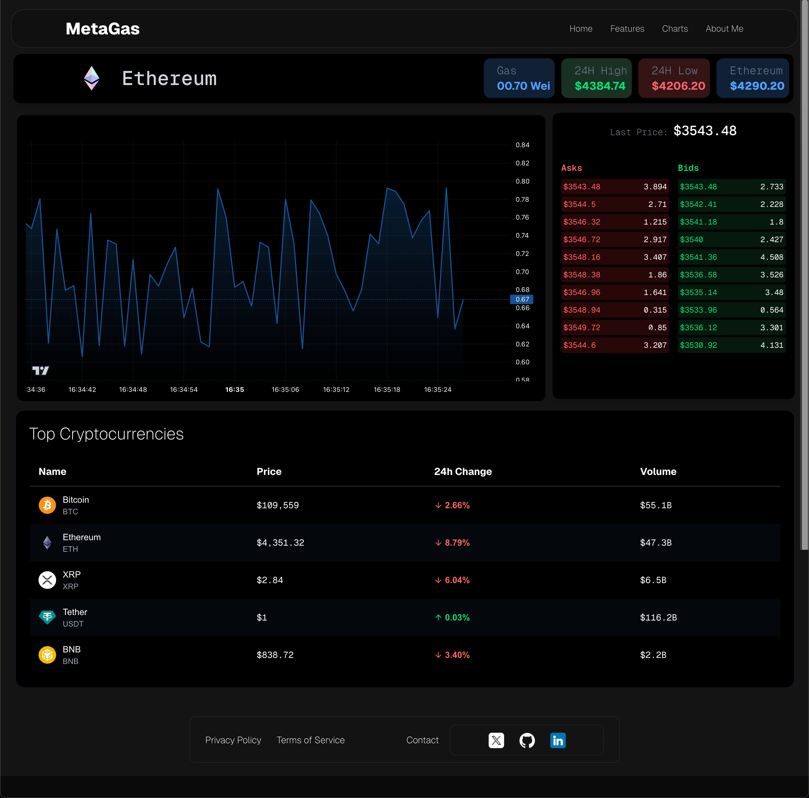

# MetaGas

MetaGas is a real-time Ethereum gas price dashboard built with Next.js and WebSocket technology. It provides live updates of gas prices streamed from a backend WebSocket server to a React client interface.


You might like to check chart interfaces app provides in ```public/ops``` until beta version is deployed.

## Features

- Real-time gas price updates using WebSocket
- Backend server implemented with Node.js and the `ws` WebSocket library
- React client built with Next.js using React hooks
- Clean and responsive UI with live Ethereum gas price display
- Easy to extend for additional blockchain support





## Project Structure

- `src/app/api/fetchEthGas.ts`: Backend WebSocket server that broadcasts Ethereum gas prices to connected clients.
- `src/app/page.tsx` (or `GasPage.tsx`): React client component that connects to the WebSocket server and displays live gas prices.
- `public/assets/ethlogo.svg`: Ethereum logo used in the client UI.
- `components/MainPage.tsx`: Main UI component that shows the gas price and related info.

## Getting Started

### Prerequisites

- Node.js (v16 or higher recommended)
- npm or yarn package manager

### Installation
 Clone the repository:

   ```bash
   git clone https://github.com/yourusername/metagas.git
   cd metagas
   ```


